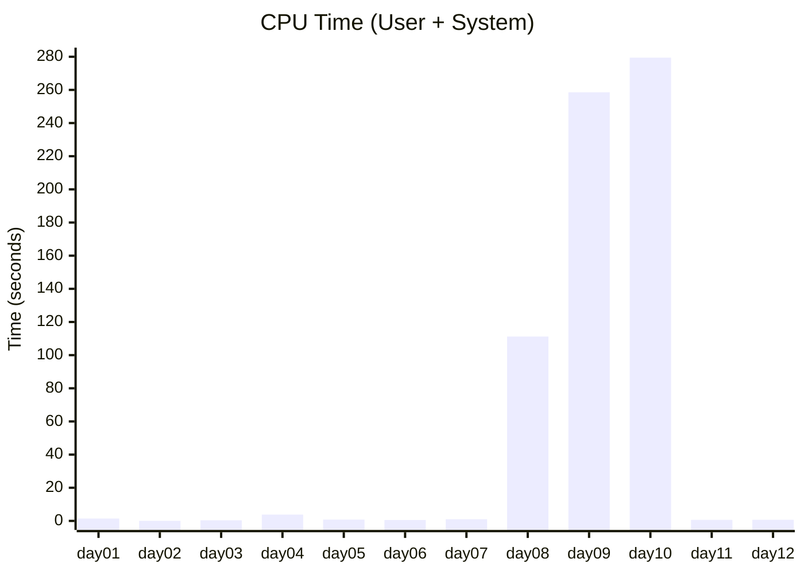
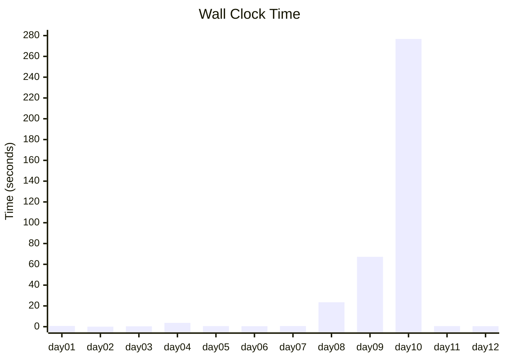
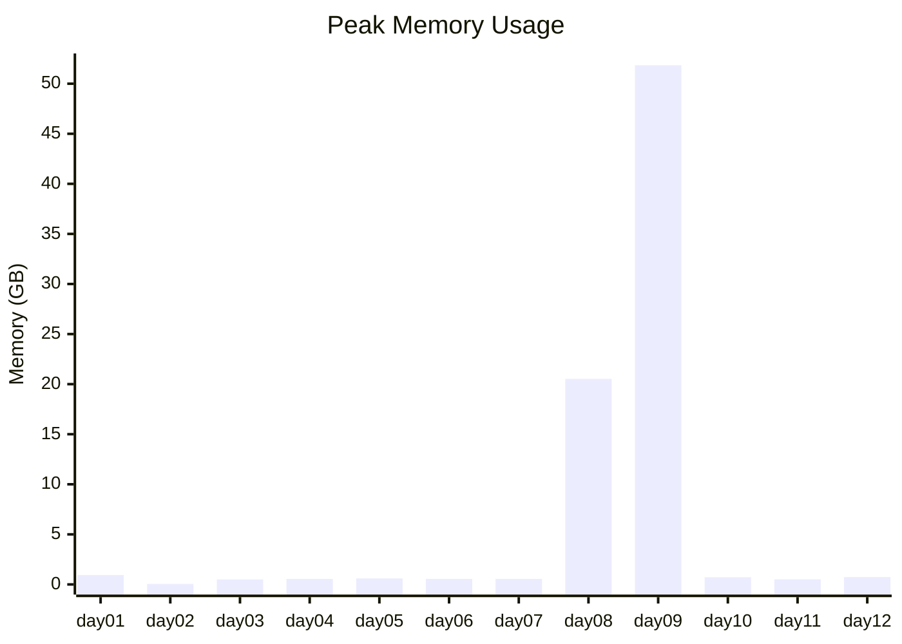

## Advent of Nix 2025

These are my solutions to Advent of Code (2025) in pure nix.

### Running solutions

For almost all solutions you'll need to invoke them as:

```
$ ulimit -s unlimited
$ nix eval --max-call-depth 2147483648 '.#dayXX'
```

In general, `nix eval '.#dayX'` (where 'X' is the number of the day, padded to
length 2, such as `nix eval '.#day03'`) will display the answer to a given day.

### Extra constraints

I've decided to avoid the nixpkgs stdlib this time.
I've vendored a small number of functions into 'lib.nix', but for the most part
I've derived library functions in lib.nix myself as needed.

## Performance

This time things aren't too bad!

This is the first time I can execute all of the solutions in one shot!

```
$ time nix eval --max-call-depth 2147483648 '.#all'
...
1746.92s  user 13.72s system 315% cpu 9:17.65 total
max memory: 87637 MB
```

Under 10 minutes, under 100GiB :D

### CPU Time (User + System)



### Wall Clock Time



### Peak Memory Usage


